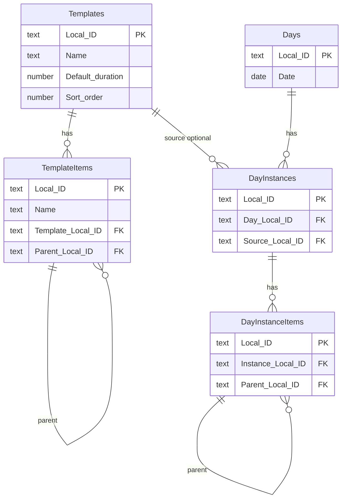

# Notion database design — Blocks app

Five databases under one workspace page (e.g. **Blocks App**). Property names below must match **exactly** — the app’s sync layer uses these strings.

## Overview



**Sync key:** every row has **Local ID** (rich text) = the app’s UUID. Notion’s page id is stored locally as `notionPageId`. Last-write-wins uses Notion `last_edited_time` vs local `updatedAt`.

**Relations vs Local ID:** use **both** — relations for browsing in Notion; **Local ID** text fields for reliable pull when relations are empty or edited in Notion.

---

## 1. Templates (library)

Reusable block templates.

| Property name | Type | Required | Maps to app |
|---------------|------|----------|-------------|
| **Name** | Title | yes | `checklistTemplates.title` |
| **Default duration** | Number | yes | `defaultDurationMin` (minutes) |
| **Sort order** | Number | yes | `sortOrder` |
| **Local ID** | Rich text | yes | `id` (UUID) |

Optional (app-only until added in Notion): repeat schedule is stored locally on the template as `repeat` (`weekday`, `timeHHMM`) and is not synced yet.

**Views (suggested):** Table sorted by Sort order · Gallery by Name.

**Env:** `VITE_NOTION_TEMPLATES_DB` = database id (32-char, with or without dashes).

---

## 2. Template Items

Items (and sub-items) for each template. **One nesting level** in the app.

| Property name | Type | Required | Maps to app |
|---------------|------|----------|-------------|
| **Name** | Title | yes | `title` |
| **Template** | Relation → **Templates** | yes* | `templateId` (via relation or Template Local ID) |
| **Template Local ID** | Rich text | yes | `templateId` |
| **Parent item** | Relation → **Template Items** (same DB) | no | parent row |
| **Parent Local ID** | Rich text | no | `parentItemId` (empty = top-level) |
| **Sort order** | Number | yes | `sortOrder` |
| **Local ID** | Rich text | yes | `id` |

\*Relation required for Notion UX; sync can rely on **Template Local ID** if relation missing.

**Self-relation setup:** In Template Items, add relation **Parent item** → Template Items, enable **two-way** synced property name **Sub-items** (optional).

---

## 3. Days

One row per calendar date.

| Property name | Type | Required | Maps to app |
|---------------|------|----------|-------------|
| **Name** | Title | yes | display = `date` (e.g. `2026-06-01`) |
| **Date** | Date | yes | `date` (no time) |
| **Local ID** | Rich text | yes | `id` |

**Views:** Table sorted by Date descending · Calendar on **Date**.

**Env:** `VITE_NOTION_DAYS_DB`

---

## 4. Day Instances

A block placed on a specific day (snapshot; independent of library after add).

| Property name | Type | Required | Maps to app |
|---------------|------|----------|-------------|
| **Name** | Title | yes | `title` |
| **Day** | Relation → **Days** | yes* | `dayId` |
| **Day Local ID** | Rich text | yes | `dayId` |
| **Source template** | Relation → **Templates** | no | `sourceTemplateId` |
| **Source Local ID** | Rich text | no | `sourceTemplateId` |
| **Duration** | Number | yes | `durationMin` |
| **Sort order** | Number | yes | `sortOrder` (order on day) |
| **Scheduled start** | Date (include time) | yes | `scheduledStartMs` (editable plan time) |
| **Added at** | Date (include time) | optional | `addedAt` (elapsed-time bar; app-managed) |
| **Note** | Rich text | no | `noteJson` (TipTap JSON string) |
| **Collapsed** | Checkbox | no | `collapsed` |
| **Local ID** | Rich text | yes | `id` |

**Views:** Table filtered by Day relation · Board by Day (optional).

**Env:** `VITE_NOTION_DAY_INSTANCES_DB`

---

## 5. Day Instance Items

Tasks for a day block (with optional sub-items).

| Property name | Type | Required | Maps to app |
|---------------|------|----------|-------------|
| **Name** | Title | yes | `title` |
| **Instance** | Relation → **Day Instances** | yes* | `instanceId` |
| **Instance Local ID** | Rich text | yes | `instanceId` |
| **Parent item** | Relation → **Day Instance Items** (same DB) | no | parent row |
| **Parent Local ID** | Rich text | no | `parentItemId` |
| **Completed** | Checkbox | yes | `completed` |
| **Sort order** | Number | yes | `sortOrder` |
| **Local ID** | Rich text | yes | `id` |

**Env:** `VITE_NOTION_DAY_INSTANCE_ITEMS_DB`

---

## Workspace layout

```
📄 Blocks App (page)
├── 🗃️ Templates
├── 🗃️ Template Items
├── 🗃️ Days
├── 🗃️ Day Instances
└── 🗃️ Day Instance Items
```

Share **all five databases** with your integration (full access).

---

## `.env.local` example

```bash
VITE_NOTION_TOKEN=secret_xxxxxxxx

VITE_NOTION_TEMPLATES_DB=aaaaaaaaaaaaaaaaaaaaaaaaaaaaaaaa
VITE_NOTION_TEMPLATE_ITEMS_DB=bbbbbbbbbbbbbbbbbbbbbbbbbbbbbbbb
VITE_NOTION_DAYS_DB=cccccccccccccccccccccccccccccccc
VITE_NOTION_DAY_INSTANCES_DB=dddddddddddddddddddddddddddddddd
VITE_NOTION_DAY_INSTANCE_ITEMS_DB=eeeeeeeeeeeeeeeeeeeeeeeeeeeeeeee
```

Database id = part of the URL:  
`https://notion.so/{workspace}/{DATABASE_ID}?v=...`

---

## What the app syncs today vs this design

| Area | Today | This design adds |
|------|--------|------------------|
| Templates | Name, duration, sort, Local ID | — |
| Template items | Name, sort, Template relation | **Parent Local ID**, **Template Local ID**, parent relation |
| Days | Name, Date, Local ID | — |
| Day instances | Name, duration, sort, Note, Day relation | **Added at**, **Collapsed**, **Day/Source Local ID** |
| Day instance items | Name, sort, Completed, Instance relation | **Parent Local ID**, **Instance Local ID**, parent relation |
| Pull merge | Relations not read (FK bugs) | Fix pull to use **\* Local ID** fields |

After you create the databases, we should update `src/sync/syncEngine.ts` to push/pull the new properties so Notion edits round-trip correctly.

---

## Manual creation checklist

1. Create page **Blocks App**.
2. Create each database as inline table on that page (or sub-pages).
3. Add properties with **exact** names from tables above (including spaces: `Default duration`, `Sort order`, `Local ID`).
4. Configure self-relations on **Template Items** and **Day Instance Items**.
5. Connect integration; copy five database IDs into `.env.local`.
6. Rebuild / restart dev server; use **Settings → Sync now**.

---

## Optional later (not v1)

- **Updated at** (number or date) duplicated from app for debugging conflicts  
- Rollup on Day: total duration from related Day Instances  
- Formula on Day Instance: schedule label (Notion-only view; app computes locally)
